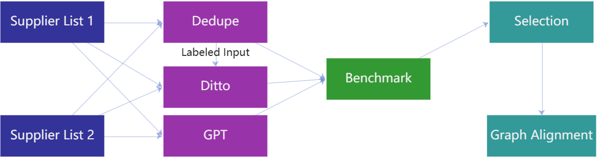

# Knowledge Graphs Integration in the Context of Supply Chain Risk Management on a Siemens Use Case

## Working with the repo

### Dependencies

#### Global
Python: 3.7.7
Requirements can be installed using the command bellow

     pip install -r requirements.txt 

#### Dedupe (csvlink)
Code with further details is accessible [here](https://github.com/dedupeio/csvdedupe)
Library can be installed using the command bellow

    pip install csvdedupe
    
#### Ditto
Code with further details is accessible [here](https://github.com/megagonlabs/ditto)
Most of the dependencies will be installed through requirements.txt. Additional required dependencies are following. Note that Ditto was code modified to use CPU only version. 

###### Spacy
Spacy models can be installed using

    python -m spacy download en_core_web_lg
    python -m nltk.downloader stopwords

###### Blocking
In order to  perform blocking in folder `/blocking/sentence-transformers` git repository must be [cloned](https://github.com/UKPLab/sentence-transformers/tree/5634c8a8b0caf22890fc455f2a2591fd25cbefb3) and installed using the cloned requirements.txt.

###### Hugging Faces 4.9.2
Detailed installation guide is available [here](https://huggingface.co/docs/transformers/installation).

    python -m venv .env          # Create a virtual environment
    .env/Scripts/activate        # Activate the environment
    pip install transformers     # Install transformers
    
Installation can be tested using
    
    python -c "from transformers import pipeline; print(pipeline('sentiment-analysis')('we love you'))"
#### GPT
    
    pip install openai
    
#### Plotting

     pip install basemap
     python -m pip install -U matplotlib

    
#### Demo Matcher Server
Detailed installation guide can be found [here](https://fastapi.tiangolo.com/tutorial/)

    pip install fastapi
    pip install "uvicorn[standard]"
    
In `server_config.py` default configurable server port is `8000`.

Note that following Ditto models must be trained before Ditto matcher execution:

    SCM-COYPU/DE    SCM-COYPU/UNPARSED/DE
    SCM-COYPU/US    SCM-COYPU/UNPARSED/US
    SCM-COYPU/CN    SCM-COYPU/UNPARSED/CN

In order to run GPT Matcher openai must be installed. In `openai_matcher.py` openai.api_key must be configured to use valid openai key. Key can be generated [here](https://platform.openai.com/account/api-keys). 
For demo purposes of the company matcher, refer to the following pdf file: (ADD PDF FILE PATH).

### Setup
#### Csvdedupe (csvlink)
In order to generate eligeable files for running csvlink, it is required to first execute the following two notebooks `data_preprocessing.ipynb` and `data_preprocessing_dedupe.ipynb`. Using data prep output files `SCM_prep_data_ID.csv` and `COYPU_prep_data.csv` csvlink can be used with the below shown command. Note that for each of the country csvlink must be executed separately.

    csvlink dedupe/data/csv_files/scm_germany.csv dedupe/data/csv_files/coypu_germany.csv \
              --config_file=dedupe/config_dedupe_de.json
#### Ditto
Scripts for all language are avaiable on project root level. Blocking training is optional pretrained model can be used instead. Scripts for languages can be separately executed. 
Order of execution is following:

1. Blocking training (Optional)
2. Blocking execution
3. Ditto training
4. Ditto execution

 Note that bash scripts must be edited for different types of Ditto input types. 
 Following input types are available:
 
 1. FULL (includes geolocation, company category and parsed name)
 2. NO-LOC (company category and parsed name)
 3. UNPARSED (raw name only)
 4. AL (same as FULL, used for alternative training sets)
 
Additional Ditto blocking information and commands can be found [here](https://github.com/megagonlabs/ditto/tree/master/blocking).

List of all Ditto tasks can be found in `configs.json`. In order to run those tasks, related input files must be provided which are generated through `data_preprocessing.ipynb` and `data_preprocessing_ditto.ipynb`.

Additional information about Ditto execution and parameters can be found [here](https://github.com/megagonlabs/ditto/tree/master).

#### GPT
Create a python script and call script using the following template

    from openai_matcher import match_companies
    
    #   Company
    #   {
    #        'name': str,
    #        'lat'?: float, 
    #        'long'?: float, 
    #   }

    res = match_companies(companyA, companyB)

## Reproducing Results
### Training code
First step towards reproducing results is to run following in order
1. `data_preprocessing.ipynb`
3. `data_preprocessing_dedupe.ipynb`
4. *Execute csvdedupe*
6. `data_preprocessing_ditto.ipynb`

Second optional step is using dedupe in order to create training data. Through preparation scripts text distance based labeling files will be generated. Using results from unsupervised tehniques such as dedupe to create training data has proven to show better results.

#### Dedupe
Using the notebook output run scripts as described in Setup. Output results will vary based on the manual input provided. Manual input can be persisted and used for later matching. Dedupe country must be executed separately for each of the countries.

#### Ditto
Move data prep output files `SCM_prep_data_ID.csv` and `COYPU_prep_data.csv` or configure paths as necessary. Follow script execution order as provided in Setup. Each of the execution step relies on the previous one. Each input configuration for each country can be executed separately from others. 

Blocking model we have used are` distilbert-base-uncased-finetuned-sst-2-english` and `bert-base-german-cased`.

#### GPT
Load an evaluation dataset to a script created in setup and run execute it for each entry.

#### Demo Matcher Server
Simply execute `server.py`. Server configuration is available `server_config.py`. Default browser will be automatically launched or a new tab will be created if it's already launched. Server can be started without ditto models, but those models must be commented out in server configuration. User manual is available in [CompanyMatcher.pdf](./CompanyMatcher.pdf)

### Evaluation code
Map company plotting is available in `/plotting/world_plots.ipynb`
ROC AUC plotting is available in `/plotting/auc_plotting.ipynb`

### Pretrained models
#### Ditto
All Ditto models can be pretrained using the information above. Ditto will automatically decide all model weights. List of all pretrained models for blocking can be found in  `/blocking/sentence-transformers/sentence_transformers/SentenceTransformers.py`
#### GPT
GPT was configured to use `gpt-3.5-turbo`. Other available models and their pricing can be found [here](https://openai.com/pricing).

### Graph Merging
Graph merging requires Dedupe results or any other result file, which follows structure noted in `merging.ipynb`.
1. First step is to export relevant data from both graphs using queries available in file `sparql_queries.txt`.
2. Further, import query results graph data to `graphs_merging` folder and execute `merging.ipynb`.
3. Once that is done in Neo4j execute queries from file `cypher_queries.txt`. Note that event data can be merged separately from company data.
